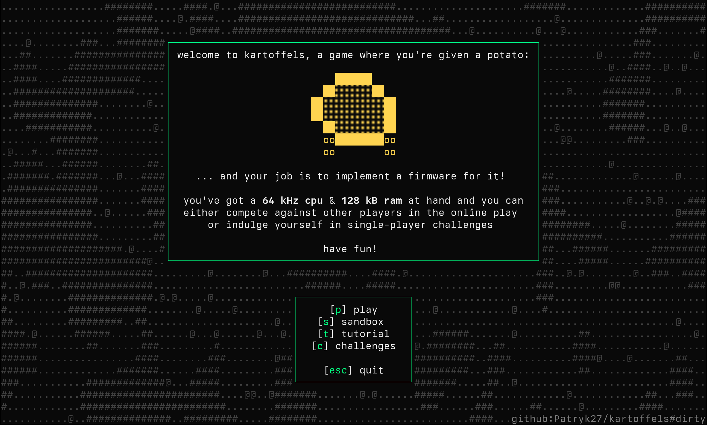
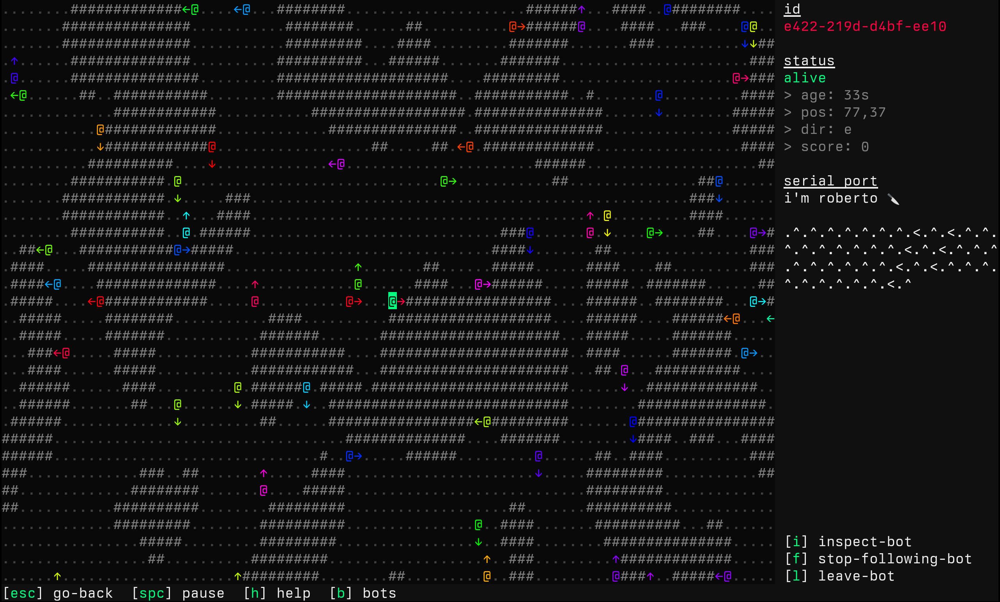

# kartoffels 🥔

<p align="center">
    <a href="https://kartoffels.pwy.io">kartoffels</a> is an online game where
    you're given a potato and your job is to implement
    <a href="https://github.com/patryk27/kartoffel">a firmware</a> for it:
</p>




<p align="center">
    <a href="https://kartoffels.pwy.io">play it in browser</a> or terminal:<br>
    <code>ssh kartoffels.pwy.io</code>
</p>

---

<div align="center">

[build](#build) • [contribute](#contribute) • [license](#license) 

</div>

---

## name

kartoffel (🇩🇪)    
= potato    
= slang for _slow machine_    
= exactly what kartoffels are!

## build

so you want to launch kartoffels on your own machine? easy!

### using nix

```bash
# step i: clone repository
$ git clone https://github.com/patryk27/kartoffels
$ cd kartoffels

# step ii: create a place for storing kartoffels, server keys etc.
$ mkdir store

# step iii: launch server
$ nix run . -- serve ./store --ssh 127.0.0.1:1314

# step iiii: join the game
$ ssh 127.0.0.1 -p1314
```

note that this only starts the ssh server - if you want to use the web frontend:

```bash
# step iii: launch server (note the `--http` argument)
$ nix run . -- serve ./store --http 127.0.0.1:1313

# step iiii: launch frontend
$ nix run .#web

# step iiiii: join the game at http://localhost:5173
```

### on linux / macos

```bash
# step i: clone repository
$ git clone https://github.com/patryk27/kartoffels
$ cd kartoffels

# step ii: build application
$ cd app
$ cargo build --release
$ cd ..

# step iii: create a place for storing kartoffels, server keys etc.
$ mkdir store

# step iiii: launch server
$ ./app/target/release/kartoffels serve ./store --ssh 127.0.0.1:1314

# step iiiii: join the game
$ ssh 127.0.0.1 -p1314
```

note that this only starts the ssh server - if you want to use the web frontend:

```bash
# step iiii: launch server (note the `--http` argument)
$ ./app/target/release/kartoffels serve ./store --http 127.0.0.1:1313

# step iiiii: launch frontend
$ cd web
$ npm install
$ npm run dev

# step iiiiii: join the game at http://localhost:5173
```

### on windows

i'd suggest installing wsl and following the linux instructions

## contribute

so you want to contribute to kartoffels? easy! -- the code is divided into
roughly three areas:

- all things risc-v (`kartoffels-cpu`),
- all things world-and-bot (`kartoffels-world`),
- all things user-interface (`kartoffels-front`).

so, say:

- if you wanted to introduce support for risc-v compressed instructions, you'd
  modify (mostly) `kartoffels-cpu`,
- if you wanted to introduce a new bot peripheral, you'd modify (mostly)
  `kartoffels-world`,
- if you wanted to introduce a new challenge, you'd modify (mostly)
  `kartoffels-front`.

note that those are just rough examples, different features or fixes might
require touching different places

also:

- use `cargo test --release` and `cargo fmt`,
- some tests (notably those ui-based) utilize snapshots - they take a
  "screenshot" (a textshot?) of the current frame and compare it against the
  expected frame - you can run `just test-and-bless` to quickly fix such tests
  after you e.g. modify a commonly-used ui widget,
- pls don't introduce larger changes (e.g. a new peripheral) without some
  discussion first - it might happen that something hasn't been implemented
  deliberately and i wouldn't like for people to waste time just to tell them
  "sorry, it doesn't fit my vision"

## license

copyright (c) 2024, patryk wychowaniec (`pwychowaniec @at@ pm.me`).

this program is free software: you can redistribute it and/or modify it under
the terms of the gnu general public license as published by the free software
foundation, version 3.

this program is distributed in the hope that it will be useful, but without any
warranty; without even the implied warranty of merchantability or fitness for a
particular purpose. see the gnu general public license for more details.

you should have received a copy of the gnu general public license along with
this program. if not, see <https://www.gnu.org/licenses/>. 
