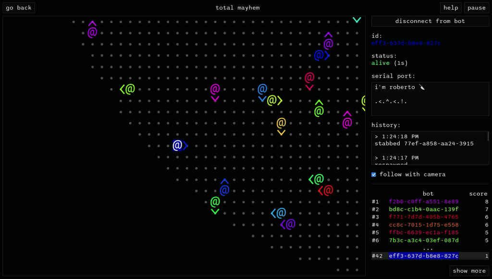

# 🥔 Kartoffels 🥔

**[Kartoffels](https://kartoffels.pwy.io) is an MMO robot combat arena!**

Implement your own bot, submit it and see it fight other bots in real-time:

[Play it online!](https://kartoffels.pwy.io)

## Name

kartoffel (🇩🇪)    
= potato    
= slang for "slow machine"    
= exactly what kartoffel bots are - slow machines indeed!

## License

Copyright (c) 2024, Patryk Wychowaniec (`pwychowaniec @at@ pm.me`).

This program is free software: you can redistribute it and/or modify it under
the terms of the GNU General Public License as published by the Free Software
Foundation, version 3.

This program is distributed in the hope that it will be useful, but WITHOUT ANY
WARRANTY; without even the implied warranty of MERCHANTABILITY or FITNESS FOR A
PARTICULAR PURPOSE. See the GNU General Public License for more details.

You should have received a copy of the GNU General Public License along with
this program. If not, see <https://www.gnu.org/licenses/>. 
